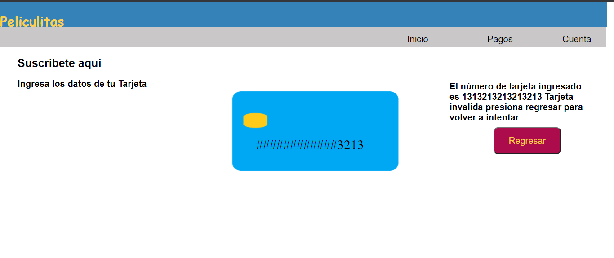
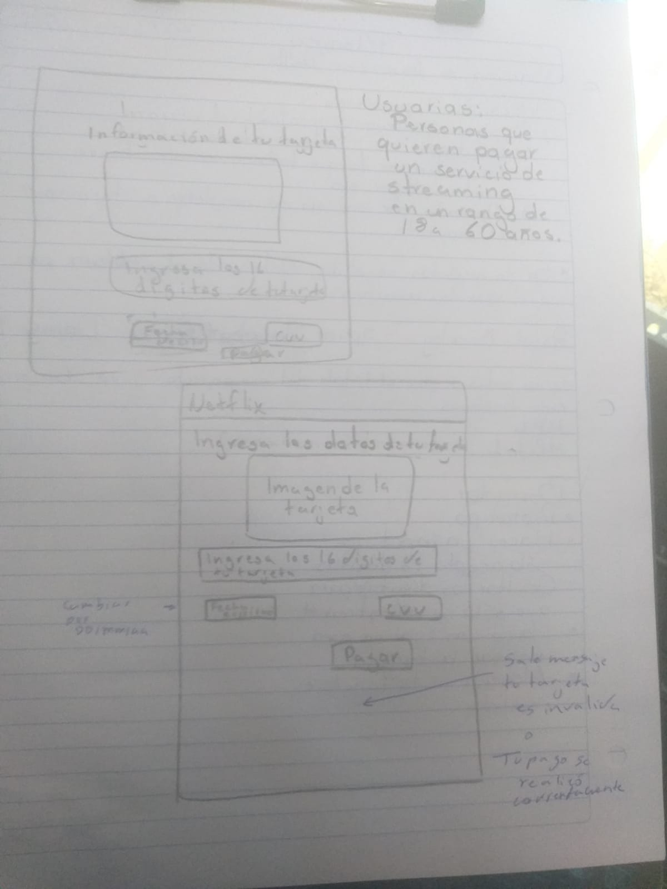
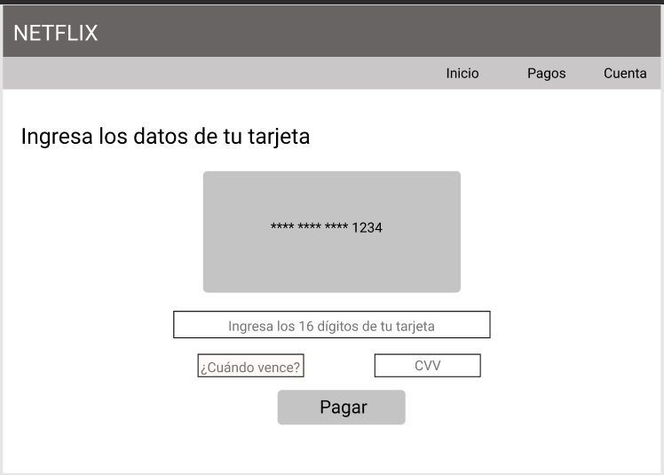

Un título con el nombre de tu proyecto.

Card Validation: Suscripción a plataforma de streaming.

Acerca del proyecto.
Esta web app está diseñada para los usuarios que deseen suscribirse a una plataforma de streaming, para lo cual deberán realizar el pago del servicio por medio de una tarjeta que debe ser validad para poder procesar la suscripción.

Investigación UX:

Usuarios 
Personas con tarjetas de crédito o débito que desean contratar un servicio de streaming, en este caso películas.

Solución al problema
Por medio de una aplicación web el usuario puede procesar su pago, ingresando los datos de su tarjeta, la cual será validada por el programa para poder procesar su pago de manera satisfactoria, o en su caso, regresar un mensaje de tarjeta inválida.

Resumen del feedback recibido.

Se agregó un mensaje para que el usuario sepa que en esa pantalla puede realizar la suscripción a la plataforma de streaming.

Plan de acción
Paso 1. Se realizó un sketch de la página.
Paso 2. Se testeó y se hicieron modificaciones pertinentes.
Paso 3. Se realizó un prototipo de baja fidelidad.
Paso 4. Se realizó el esqueleto de la página con html.
Paso 5. Se le dio funcionabilidad con JS en momentos de bloque se tabajó con CSS.
Paso 6. Se aplicaron las pruebas unitarias.
Paso 7. Se corrigió el código.
Paso 8. Se trabajó CSS.
Paso 9. Se subieron cambios Github.
